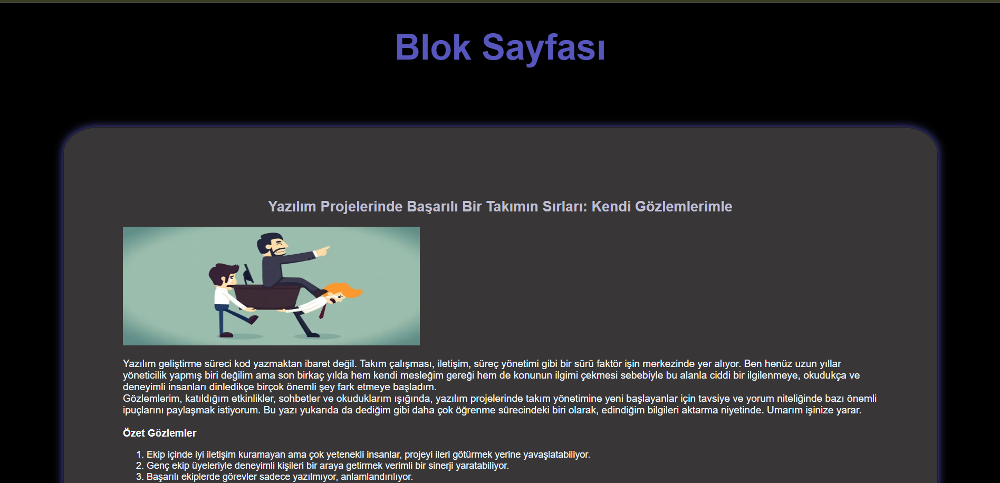

###  Ödev 2 - Kişisel Blog Sayfası Oluşturma - Teslim Et 
[Blog Sayfası Çalışması --> Sayfaya Gitmek için Tıklayınız](http://127.0.0.1:5500/index.html)

Aşağıdaki gereksinimleri karşılayan bir HTML formu oluşturuldu.

1. Sayfanın temel yapısını oluşturmak için HTML5 doküman yapısı kullanıldı.
2. `<head>`etiketinin içinde sayfa başlığı `<title>` ve karakter seti `<meta charset="UTF-8">` olarak ayarlandı.
3. Sayfanın en üstünde blogun adını içeren bir ana başlık `<h1>` yazıldı.
4. Her blog yazısı için bir başlık `<h2>` ve bir paragraf `
` eklendi. Üç blog yazısı eklendi.
5. Her blog yazısında en az bir sırasız liste `<ul>` ve sıralı liste `<ol>` kullanarak önemli noktalar ve maddeleri listelendi.
6. Her blog yazısına  bir görsel `` eklendi ve alt özniteliğini dolduruldu.
7. Blog yazılarının içinde başka kaynaklara bağlantılar `<a>` eklendi. En az iki bağlantı olacak şekilde ayarlandı.

### Ekstra olarak tablo eklenmiştir.

