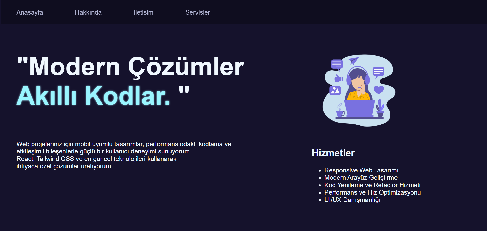
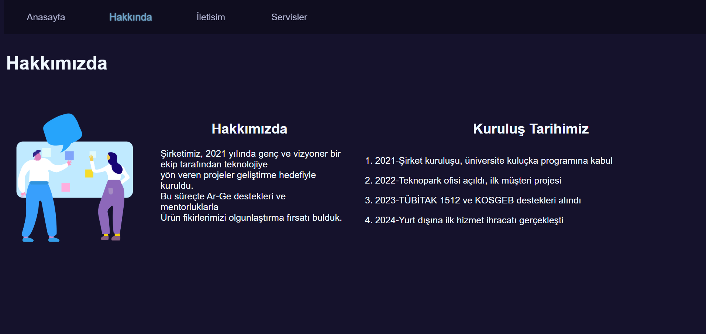
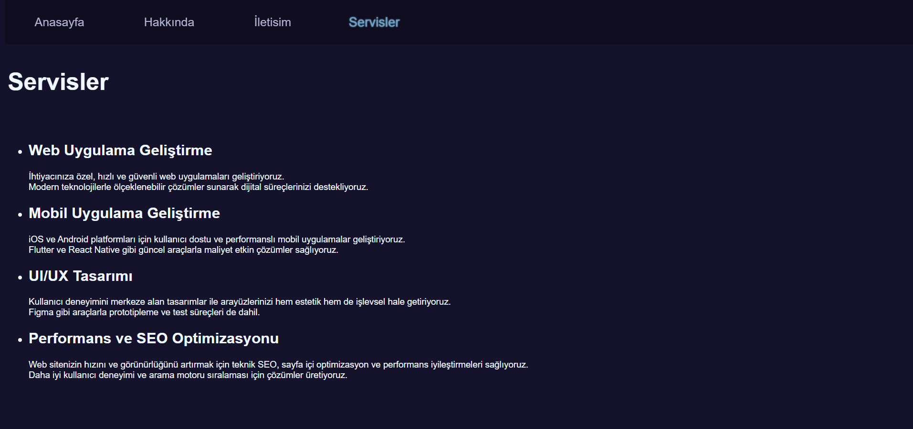
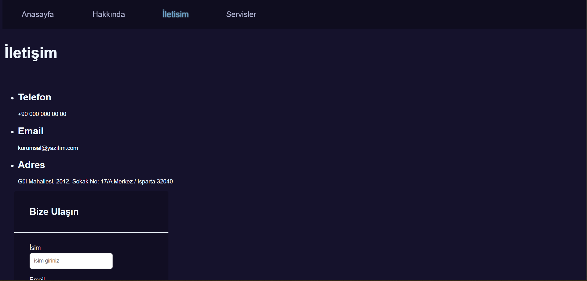
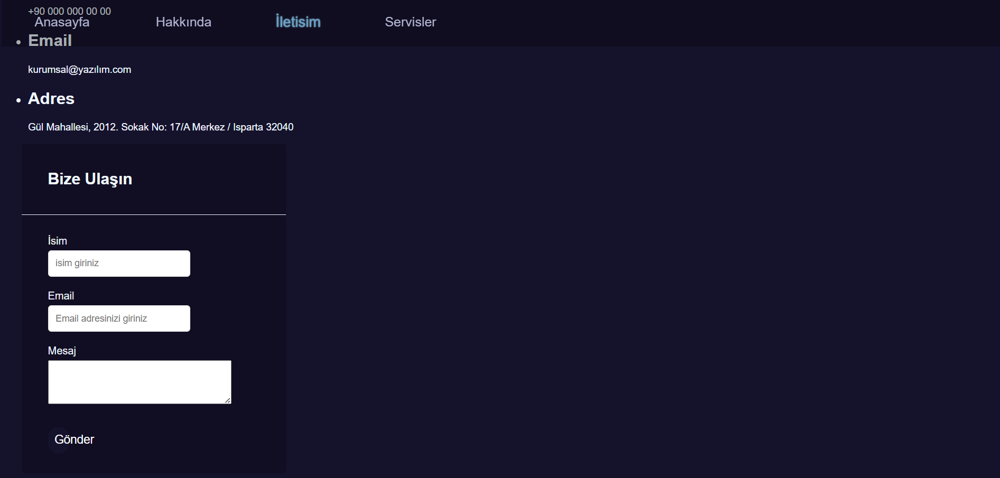

###  Ödev 3 - Rehber Web Sitesi Oluşturma

git

***Genel Yapı:***

Ana sayfa (index.html) ve  üç alt sayfa (hakkinda.html, iletisim.html, servisler.html) oluşturuldu.

1. Sayfanın temel yapısını oluşturmak için HTML5 doküman yapısı kullanıldı.
2. `<head>`etiketinin içinde sayfa başlığı `<title>` ve karakter seti `<meta charset="UTF-8">` olarak ayarlandı.

***Navigasyon Menüsü:***

3. Her sayfanın en üstünde, diğer sayfalara bağlantılar içeren bir navigasyon menüsü oluşturuldu. Menüde dört bağlantı `<a>` mevcuttur. Ana Sayfa, Hakkında, Servisler, İletişim.

***Ana Sayfa (index.html):***

4. Ana sayfada web sitemin amacını belirten bir ana başlık `<h1>` eklendi.

5. Bir tanıtım metni için paragraf `
` yazıldı.

6. Bir görsel `` eklendi ve alt özniteliği dolduruldu.

7. Ana sayfada  bir sıralı liste `<ol>`  kullanarak hizmetler listelendi.

***Hakkında Sayfası (hakkinda.html):***

8. Şirketim hakkında bilgi veren bir başlık `<h2>` ve birkaç paragraf `
` eklendi.

9. Kuruluş tarihleri için sıralı liste `<ol>` kullanıldı.

***Servisler Sayfası (servisler.html):***

10. Sunulan hizmetlerin bir listesi oluşturuldu. Her hizmet için bir başlık `<h2>` ve açıklayıcı bir paragraf `
` eklendi.

11. Hizmetleri tanımlamak için sırasız liste `<ul>` kullanıldı.

***İletişim Sayfası (iletisim.html):***

12. İletişim bilgilerini içeren bir başlık `<h2>` ve bir paragraf `
` yazıldı.

13. İletişim bilgileri (adres, telefon, e-posta) için bir sırasız liste `<ul>` kullanıldı.

14. Bir iletişim formu `<form>` oluşturuldu. Formda ad, e-posta ve mesaj alanları eklendi. 

