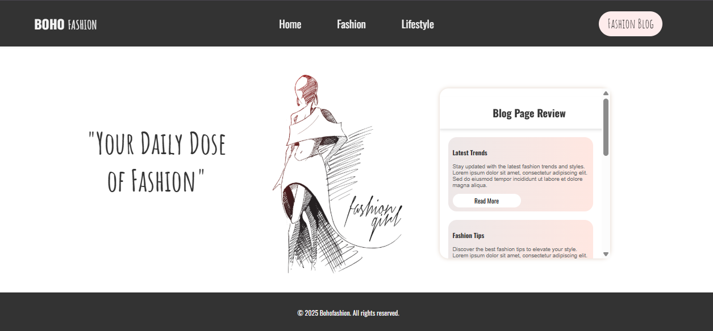

###  Ödev 1 - Blog Sayfası Oluşturma -
[Fashion Blog Sayfası Çalışması --> Sayfaya Gitmek için Tıklayınız]()

Aşağıdaki gereksinimleri karşılayan bir HTML formu oluşturuldu.

1. `<!DOCTYPE html>` bildirimi kullanılmıştır. HTML5 standardını belirtmek amacıyla yapılmıştır.
2. `<html lang="en">`etiketi kullanılmıştır. Sayfa dilinin İngilizce olduğunu belirtmek amacıyla yapılmıştır.
3. `<meta charset="UTF-8">` etiketi kullanılmıştır. UTF-8 karakter kodlaması ayarlanmıştır.
4. `<meta name="viewport" content="width=device-width, initial-scale=1.0">` etiketi kullanılmıştır. Sayfanın mobil uyumlu olması için yapılmıştır.
5. Favicon bağlantısı yapılmıştır. Tarayıcı sekmesinde özel simge göstermek için kullanılmıştır.
6. style.css dosyası bağlanmıştır. Tüm özel stiller bu dosya ile sağlanmıştır.
7. Google Fonts’tan "Oswald" ve "Amatic SC" yazı tipleri eklenmiştir. Başlıklar ve metinlerde özgün fontlar kullanılmıştır.
8. `<header>` etiketi kullanılmıştır. Sayfa başlığı ve navigasyon barı bu alanda oluşturulmuştur.
9. `<h1>` başlığı içinde `` etiketi kullanılmıştır. "FASHION" kelimesi farklı font ile vurgulanmıştır.
10. `<nav>` etiketi ve içinde ul > li > a yapısı ile navigasyon menüsü yapılmıştır.
11. button etiketi ile "Fashion Blog" butonu oluşturulmuştur. Tıklanınca blog sayfasına yönlendirme yapılmıştır.
12. .hero-section adında bir`<section>` tanımlanmıştır. Ana tanıtım alanı olarak kullanılmıştır.
13. .hero-content içinde article etiketleri ile blog yazı kartları yerleştirilmiştir.
14. Her article kartında başlık `<h3>`, açıklama `
` ve "Read More" butonları kullanılmıştır.
15. Footer alanı `<footer>` etiketiyle yapılmıştır. Telif hakkı bilgisi yerleştirilmiştir.
16. CSS tarafında *, html, body gibi seçicilerle Reset CSS işlemi yapılmıştır. Varsayılan boşluklar sıfırlanmıştır.
17. :root içinde özel CSS değişkenleri tanımlanmıştır. Renk, font, arka plan gibi değerlerin tekrar kullanılabilir olması sağlanmıştır.
18. header için display: flex, justify-content: space-around, align-items: center gibi stiller kullanılmıştır. Üst menü düzenlenmiştir.
19. .header arka plan rengi, yazı rengi, backdrop-filter ve gölge ile stilize edilmiştir.
20. .header h1 ve header h1 span için farklı yazı tipleri atanmıştır.
21. nav ve altındaki ul li için yatay menü yapısı kurulmuştur. Liste işaretleri kaldırılmış, boşluklar ayarlanmıştır.
22. Navigasyon linklerine (a) yazı rengi, yazı tipi ve hover efekti uygulanmıştır.
26. .fashion-blog-button için yuvarlak hatlı, yazı tipi özel ve kullanıcı etkileşimli buton yapılmıştır.
23. .hero-section içinde display: flex, flex-direction: row gibi özelliklerle yatay içerik yerleşimi yapılmıştır.
24. .hero-content alanına genişlik, yükseklik, box-shadow, border-radius ve overflow-y: scroll uygulanmıştır.
25. .hero-card için dikey flex düzeni, linear-gradient arka plan, iç boşluk ve kart arası boşluk ayarları yapılmıştır.
26. .hero-content h2 başlığına position: sticky verilerek kaydırma sırasında sabit kalması sağlanmıştır.
27. .hero-card h3 ve p öğeleri için font, renk ve yazı boyutu ayarlanmıştır.
28. footer alanına arka plan rengi, yazı rengi, ortalanmış metin ve iç gölge (inset box-shadow) uygulanmıştır.
29. .article-section h2, .article-content ve .article-card ile blog detay sayfası için içerik kartları oluşturulmuştur.

