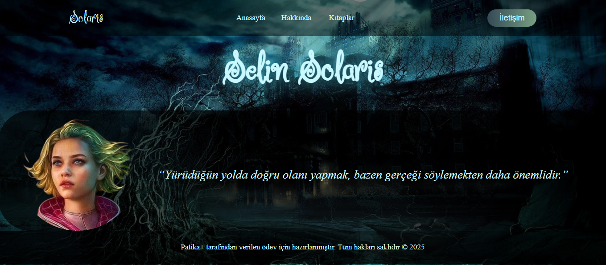
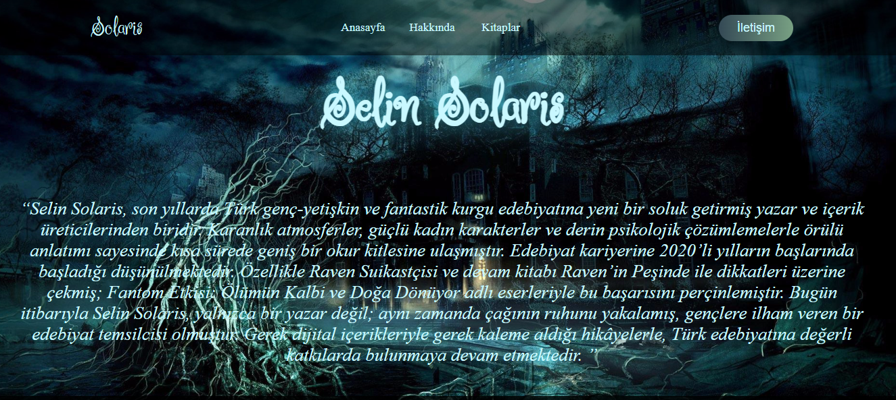
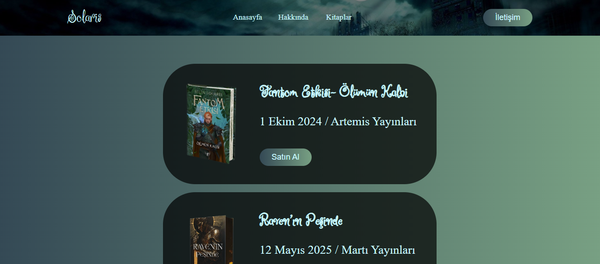
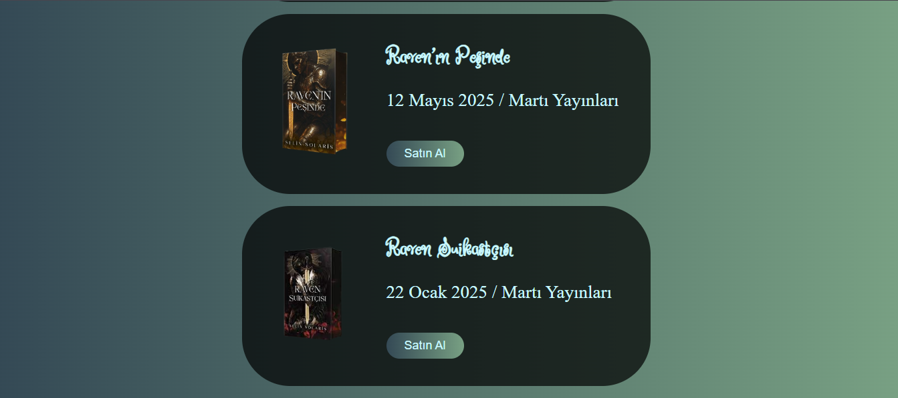

###  Ödev 2 - Yazar Sayfası Oluşturma -

Aşağıdaki gereksinimleri karşılayan bir HTML formu oluşturuldu.

1. `<!DOCTYPE html>` bildirimi kullanılmıştır. HTML5 standardını belirtmek amacıyla yapılmıştır.
2. `<html lang="en">`etiketi kullanılmıştır. Sayfa dilinin İngilizce olduğunu belirtmek amacıyla yapılmıştır.
3. `<meta charset="UTF-8">` etiketi kullanılmıştır. UTF-8 karakter kodlaması ayarlanmıştır.
4. `<meta name="viewport" content="width=device-width, initial-scale=1.0">` etiketi kullanılmıştır. Sayfanın mobil uyumlu olması için yapılmıştır.
5. Google Fonts’tan Ruge Boogie yazı tipi projeye dahil edilmiştir.
6. Dış stil dosyası (style.css) bağlanmıştır.
7. Navigasyon çubuğu (navbar) yapılandırılmıştır:
8. Anasayfa, Hakkında, Kitaplar linkleri eklenmiştir.
9. İletişim sayfasına yönlendiren buton yerleştirilmiştir.
10. Başlık ve profil resmi gösterilmiştir.
11. Altına dikkat çekici bir alıntı eklenmiştir.
12. Sayfa sonuna, telif notu içeren bir footer bölümü eklenmiştir.
